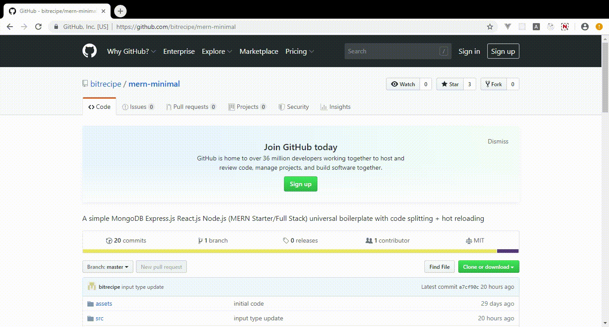

# mern-minimal

A simple MongoDB Express.js React.js Node.js universal(isomorphic) mern starter kit with code splitting + hot reloading.



## Requirement
  - Node.js v8.12+
  - MongoDB v3+
### Tech
* react v16
* redux v4
* react-router v5
* redux-form v8
* loadable-components v5
* express v4
* mongoose v5
* webpack v4
* enzyme v3
* jest v24
* babel v7
* bootstrap css v3
### Getting Started
```sh
$ git clone https://github.com/bitrecipe/mern-minimal.git
$ cd mern-minimal
$ npm install
```
For development.
```sh
$ npm run start:dev
```
For production.
```sh
$ npm run build:start:prod
```
For test.
```sh
$ npm run client:test
```
### License
MIT
